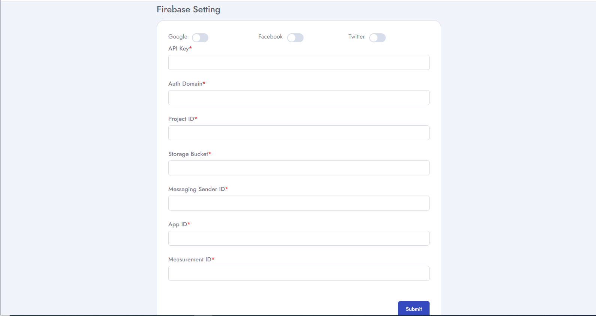

# Firebase setting
To setup **Firebase Settings** follow the procedures…

- Go to **Admin Panel** &  click **System Settings**
- Then go to **Firebase Setting** and here we can set **Google, Facebook, Twitter, API Key, Auth Domain, Project ID, Storage Bucket, Messaging Sender ID, App ID, Measurement ID** etc.

