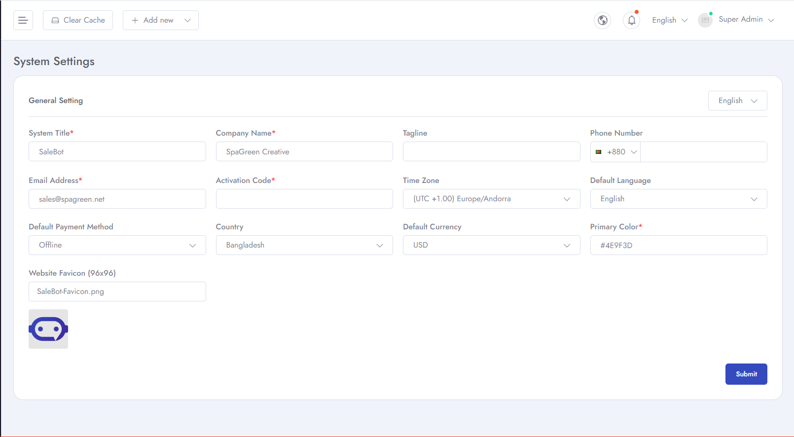

# Configure general settings
To setup **General Settings** follow the procedures…

- Go to **Admin Panel** &  click **System Settings**
- Then go to **General Settings** and here we can set **system name, default language, currency, icon** etc.

