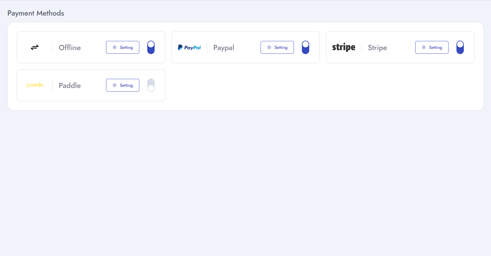

# Setup payment gateway

To setup **Payment Gateway** follow the procedures…

- Go to **Admin panel** &  click ** Payment gateway**
- Switch on by clicking the switcher of the methods which you want to activate.
- Insert necessary Information of the methods.

  - **Paypal** – Insert the **paypal client ID**, **Client secret** and switch off the **sandbox mode**(which for demo transactions). Then click on **save**. 
  - **Stripe** – Insert the **stripe key**, **stripe secret** which you will get from your **stripe account** and switch off the sandbox mode(which for demo transactions).Then click on **save**.
  - **Paddle** – Insert the **api key**, **client token** which you will get from your **paddle account** and switch off the sandbox mode(which for demo transactions).Then click on **save**
  - **Offline** –**offline payment settings** which you can set your own offline payment method details.
  

