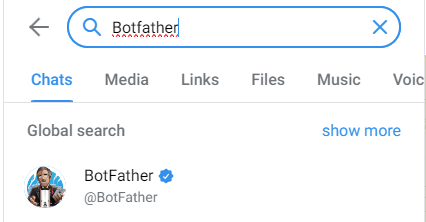
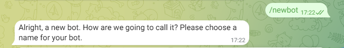
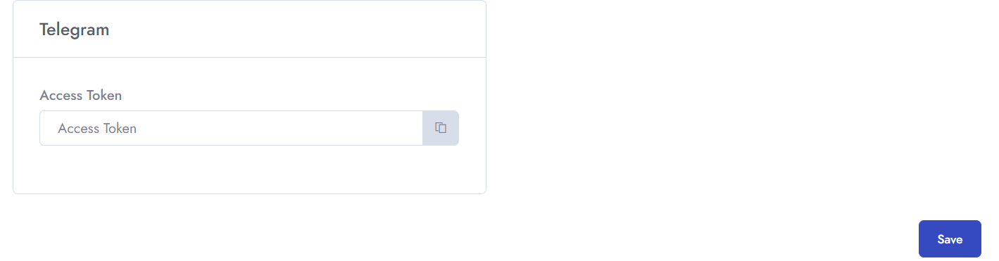
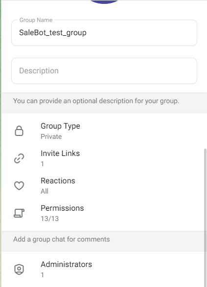
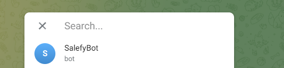
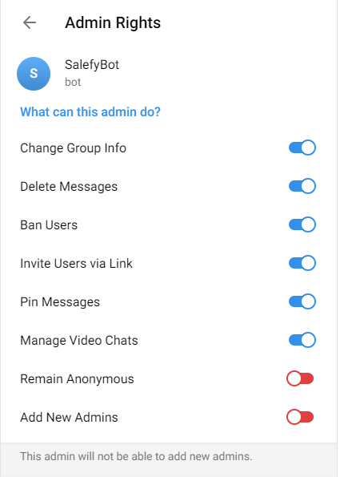
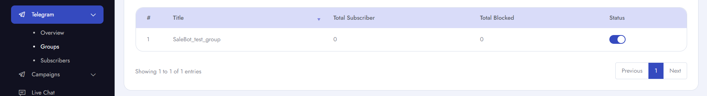

# Step1 Create Telegram Bot
To setup **Telegram Bot** follow the procedures…

- Go to **Telegram** &  search **BotFather** for creating a **telegram bot**

- Then type **/newbot** &  you can procedure for next steps.

- Then you should set **name** &  **username** for the bot. Must use **bot** at the end of username.
- You will get **access token** from that message.

# Step2 Connect With Webhook

- Go to settings of the **client module** and paste the **access token**.
- Then you will be connected with the telegram module.

# Step3 Make the bot as group admin

- After connecting with the module you need to make the bot as your operating group **admin**.

# Step4 Send a test message from the group in order to access features from website

- You need to send a **test message** from your **created group**.

- Then,if you reload your **telegram module**, you can get all the details of the **group** you have created and also can see the **subscriber's list**.

