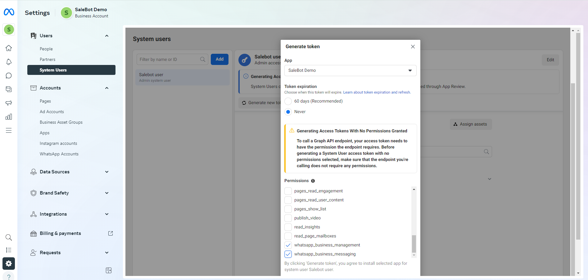

# Step1 Create Facebook Developer App
To setup **Whatsapp Feautre** follow the procedures…

- Go to **developer.facebook.com** &  login with **Meta Account**
- Then go to **Create App option** and create a **new app**

- Select **Other Option** and click **next**

- Select **Business** from **App Type**

- Provide **an unique name** for the **App**

- Go to **app dashboard** and select **whatsapp** for the **integration**. Then select **whatsapp API** settings.

- From **API Settings** you can get **temporary access token**,**Phone Number ID** and **Whatsapp Business Accout ID**. These credentials are essential for next step.

# Step2 Connect Webhook
To setup **Webhook** with **Whatsapp API credentials**  follow the procedures…

- Go to **Client Module** &  click **Settings**
- Then paste **Token**,**Phone Number ID** and **Whatsapp Business Account ID**. After completing the setup, you can access whatsapp features
## whatsapp_1

# Step3 Create Permanent Access Token
To setup **Permanent Token** instead of **temporary token** follow the procedures…

- Go to **business.facebook.com** &  go to your **app**.
- Create a **system user** for the app

- From **Accounts**->**Apps**->**Assign People** the correct rights.

- After giving rights add the people into the **app**.

 

- From next window select time expiration to **never** and select **whatsapp_business_management** and **whatsapp_business_rights**.
- New **permanent token** will be generated.

