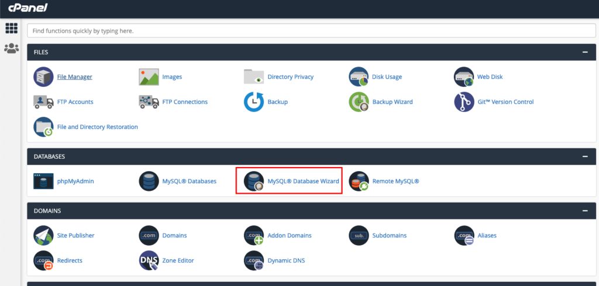
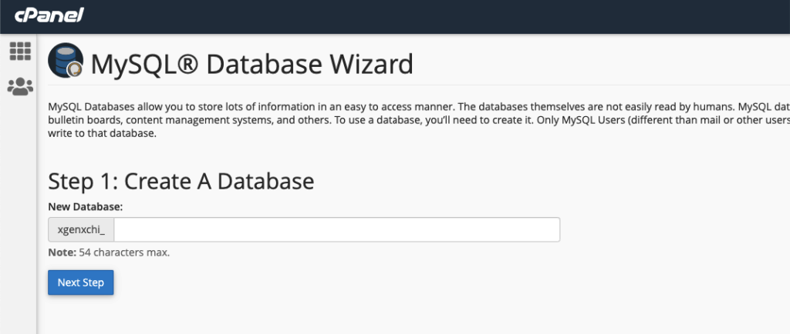
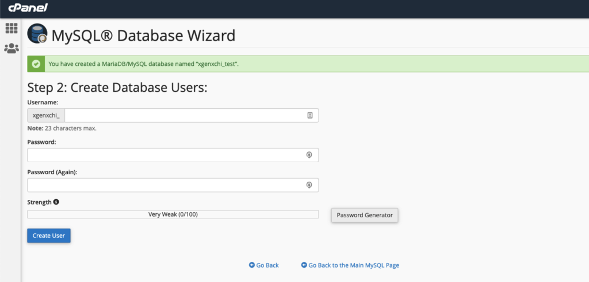
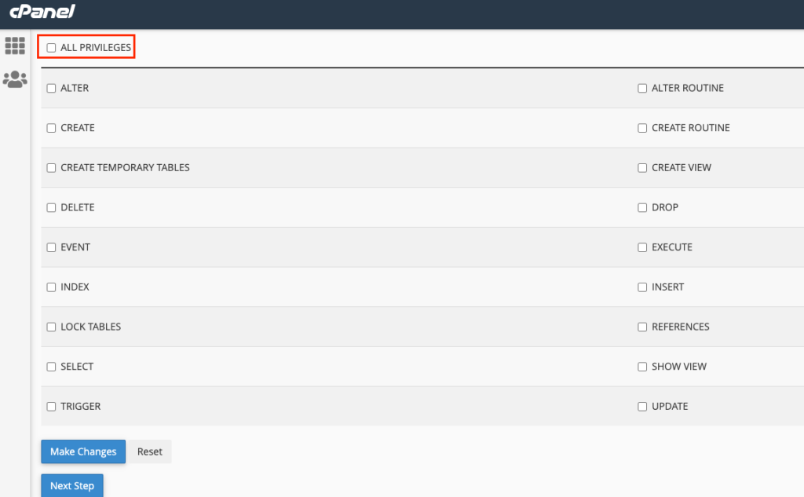
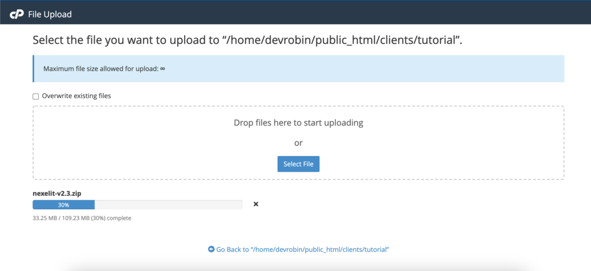
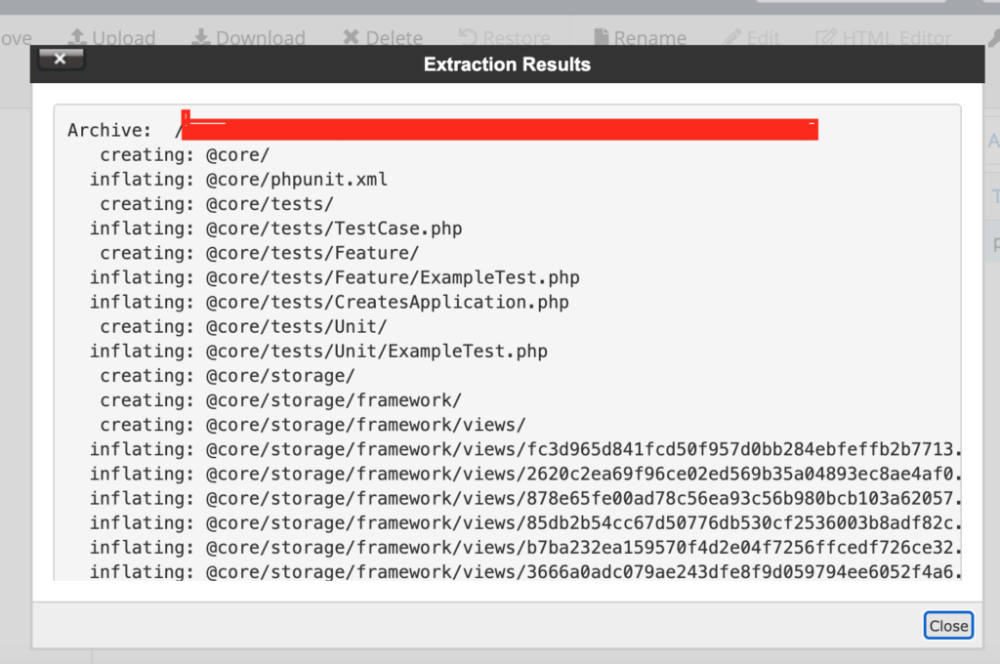
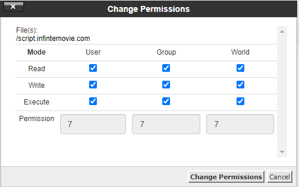
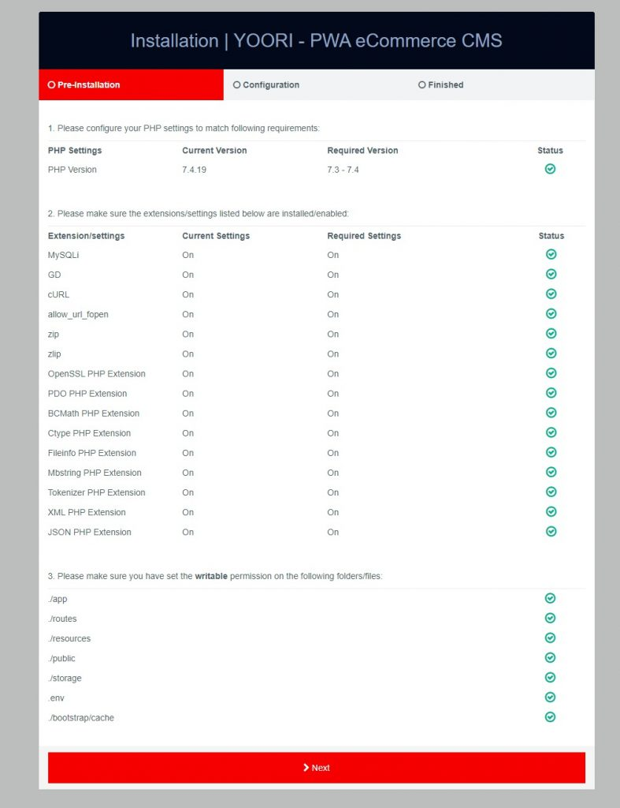
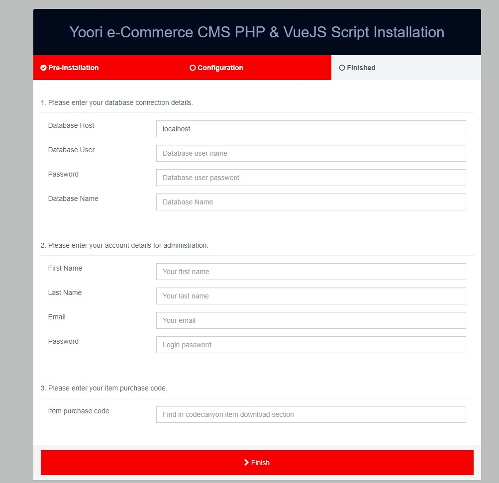

# How to install the script?

### Step : 01

Download file from codecanyon and extract in your pc and you will get 03 folder. Listed below
- Documentation
- Installable File
### Step : 02

01.** Now login to your cpanel and go to > MySQL® Database Wizard**

02. **Create database**

03. **Create Database Users, do not forget to keep your database user password, we will need this while we run installation wizard.**

04: **Add user to the database. check all privileges and click make changes. then click “Next Step” Database create is done, keep database user, database name, database password in a note.**

05.** Upload installable file to server**

06. **unzip the installable file to server**

Check Permission of index.php file, make sure it’s file permission to 777

### Step : 03

Open browser and hit you server URL. Example: https://example.com/

If all the requirements are fulfilled then click on Next

Your database connection details:

- **Database Host**: your hosting name, e.g localhost
- **Database User**: the username that you have created with all privileges.
- **Password**: that user password.
- **Database Name**: your database name for e.g yoori_db.

Your account details for administration:

- **First Name**: that will be the Administrator first name
- **Last Name**: that will be the Administrator last name
- **Email**: email for login and you can’t change this email.
- **Password**: password for admin login.
- **Item purchase code**: that you got when purchasing our product from Envato.
- After successful installation, system will redirect you to the home page.

!!! warning "Please Note Carefully"

    Given Administrator credentials will be serve as the Super Admin email and password for accessing admin dashboard

**Login to Admin Panel**

For login to the Admin Panel click on Login from the top menu give your admin email and password that you have given in time of installation.
