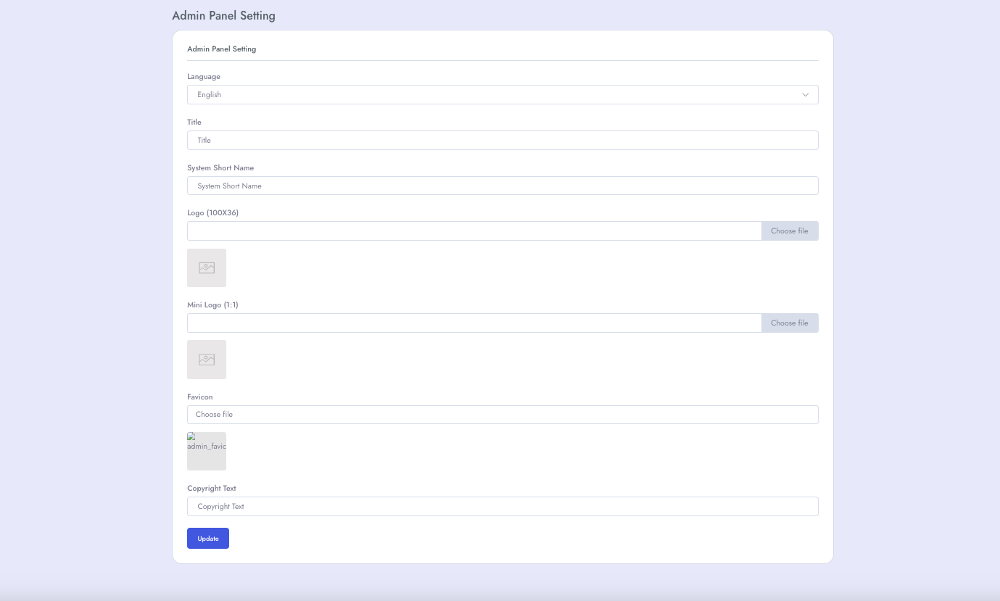

# Configure admin settings
To setup **Admin Panel Settings** follow the procedures…

- Go to **Admin Panel** &  click **System Settings**
- Then go to **Admin Panel Setting** and here we can set **Language, Title, System Short Name, Logo, Mini Logo, Favicon, Copyright Text** etc.

