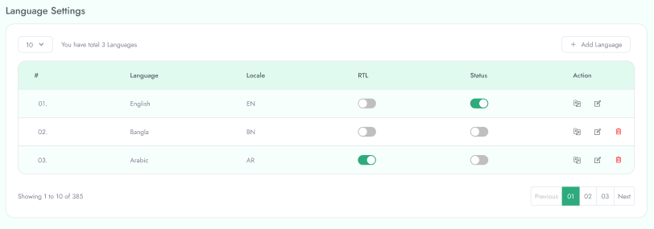

# Setup language

To configure **Language** follow the procedure mentioned below:

 - Go to left navigation bar and click  **System Setup > Language**
 - To create new Language fill the language name and select the locale and flag
 - Then click save
