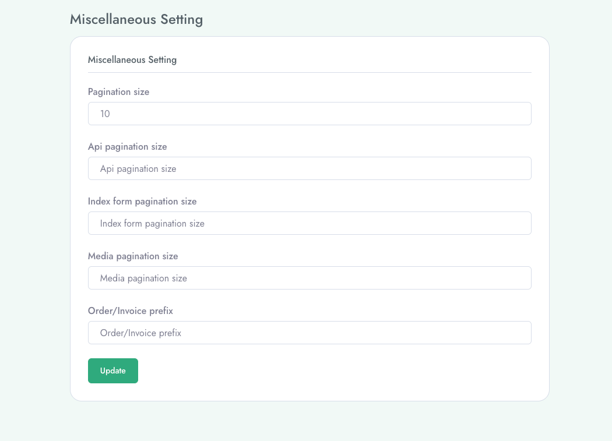

# Configure general settings
To setup **Miscellaneous Settings** follow the procedures…

- Go to **Admin Panel** &  click **System Settings**
- Then go to **Miscellaneous** and here we can set **Pagination size, Api pagination size, Index form pagination size, Media pagination size, Order/Invoice prefix** etc.

