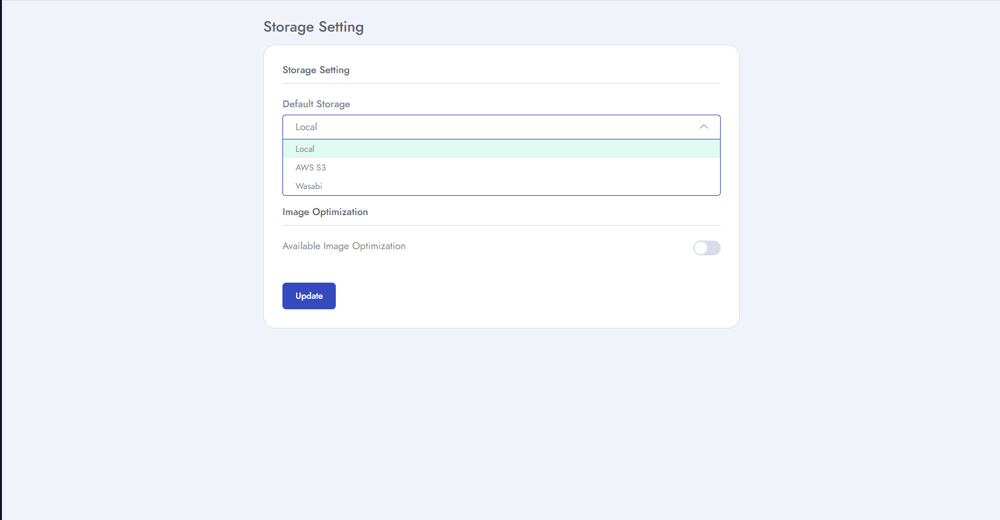

# Setup Storage

**Yoori** supports **local** as well as **Amazon S3** for storage managing. You can either choose the **local** or **S3** for storage. . For **Amazon S3** you have to provide the required data. Details given below:

- For Amazon S3 you have to provide the required data

- For **S3** you will need to provide your **aws_access_key_id, aws_secret_key_id, default_region and aws_bucket**.
- Get your data from Amazon S3, for  [help click here](https://medium.com/@shamnad.p.s/how-to-create-an-s3-bucket-and-aws-access-key-id-and-secret-access-key-for-accessing-it-5653b6e54337)..
- You must need to make sure that provided credentials are correct.
- Go to left navigation bar and click  **System Setup > Storage**
