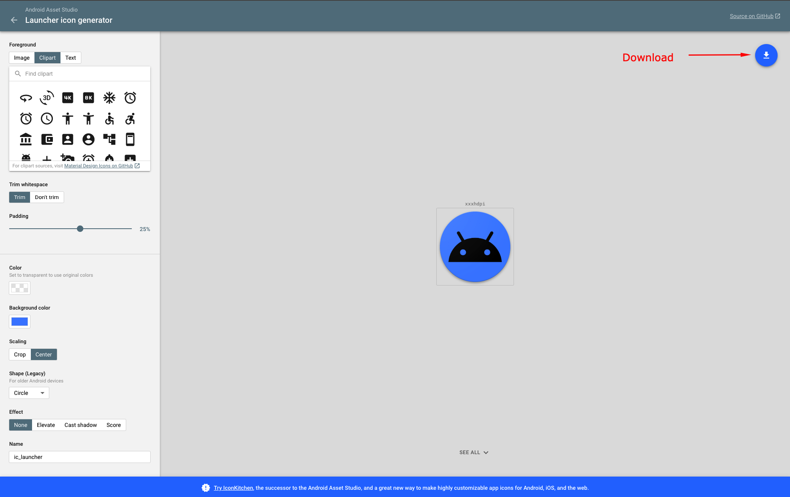
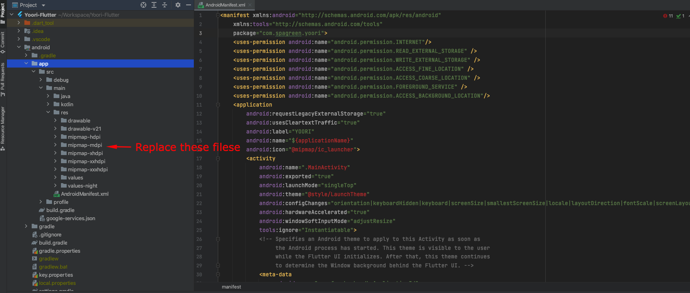

# Change Android Luncher Icon

Open this link from your browser.
Create your desired launcher icon and download.

Extract the downloaded zip file. Go to Project » android » app » src » main » res and replace existing files with your extracted files.

