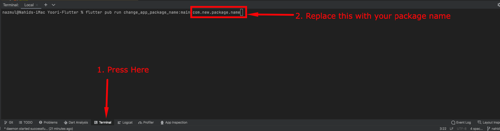

# Change Android Package Name

Open terminal from your android studio.
Write flutter pub run change_app_package_name:main com.new.package.name and replace com.new.package.name with your desired package name and press enter.

