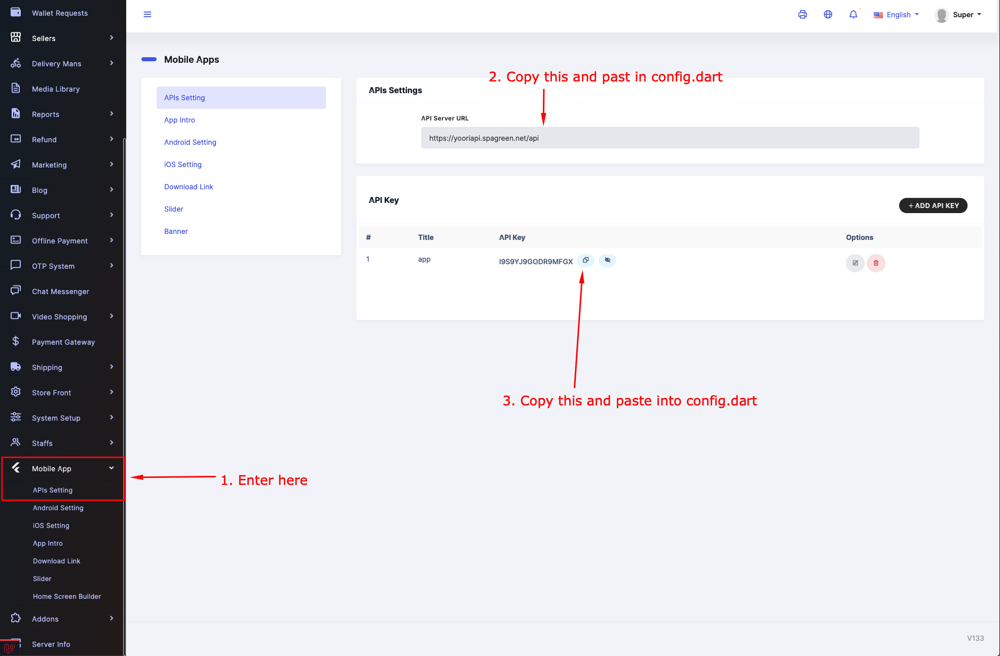
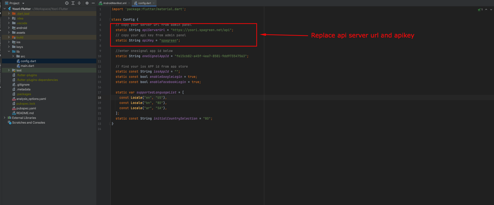

# Change API Servre Details

&nbsp;

Once you have installed Yoori and you have logged in as Administrator role.
Go to API Setting from Mobile App > API Setting

Copy API SERVER URL from Admin panel and paste it to config.dart file.
Copy API KEY from Admin panel and paste it to config.dart file.

