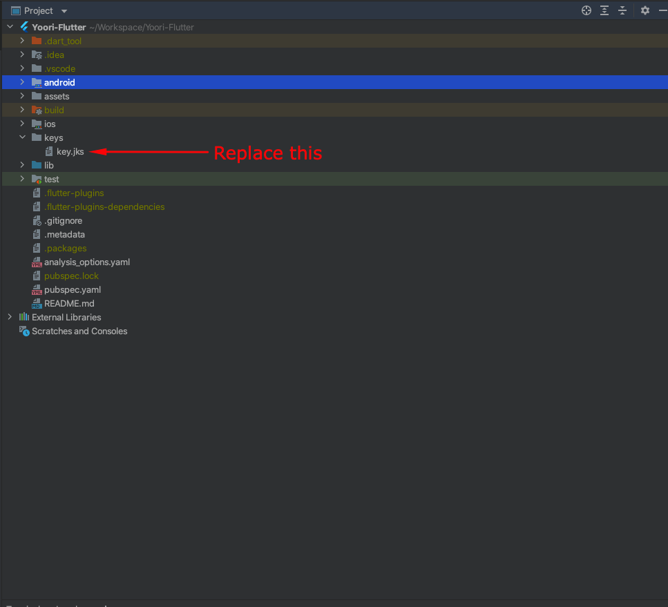

Generate Signed APK
First create a key-store file by following this link
Then Copy your key.jks file to Project » keys » key.jks

To create apk, open android studio terminal then write command flutter build
apk --no-tree-shake-icons

To create split apk, open android studio terminal then write command flutter build
apk --split-per-abi --no-tree-shake-icons

To create app bundle, open android studio terminal then write command flutter build app bundle

--split-per-abi --no-tree-shake-icons

A Signed APK/Split APK or app bundle will be built according to your command
