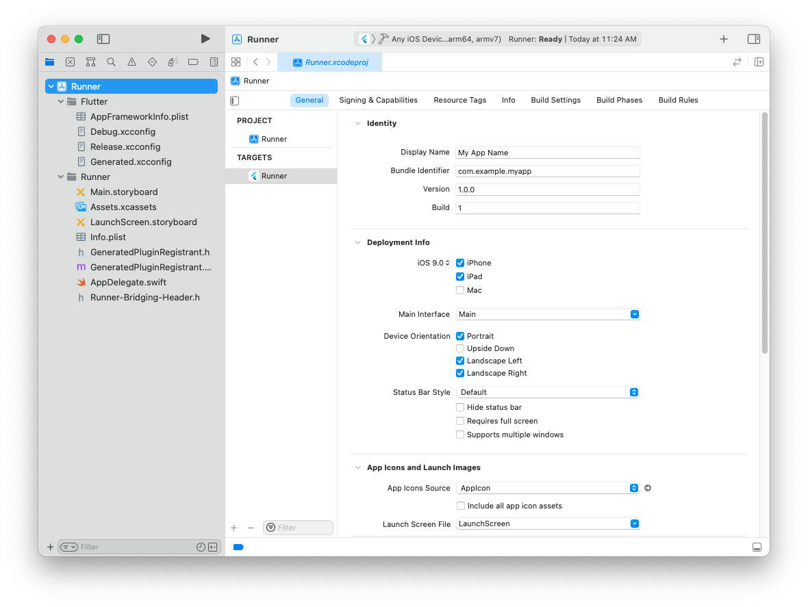

Review Xcode project settings
This step covers reviewing the most important settings in the Xcode workspace. For detailed procedures and descriptions, see Prepare for app distribution.
Navigate to your target’s settings in Xcode:
Open the default Xcode workspace in your project by running this command in a terminal window from your Flutter project directory.
open ios/Runner.xcworkspace

To view your app’s settings, select the Runner target in the Xcode navigator.
Verify the most important settings.
In the Identity section of the General tab

Display Name.

The display name of your app.
Bundle Identifier.

The App ID you registered on App Store Connect.
In the Signing & Capabilities tab
Automatically manage signing

Whether Xcode should automatically manage app signing and provisioning. This is set true by default, which should be sufficient for most apps. For more complex scenarios, see the Code Signing Guide
Team

Select the team associated with your registered Apple Developer account. If required, select. Add Account... then update this setting.
In the Deployment section of the Build Settings tab
iOS Deployment Target
The minimum iOS version that your app supports. Flutter supports iOS 9.0 and later. If your app or plugins include Objective-C or Swift code that makes use of APIs newer than iOS 9, update this setting to the highest required version.
The General tab of your project settings should resemble the following:

