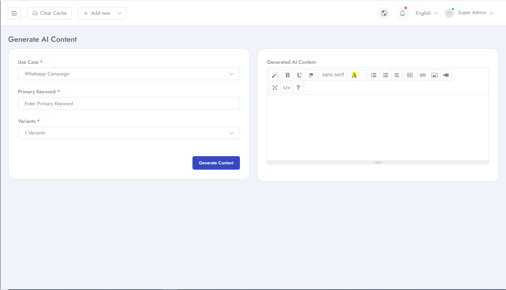
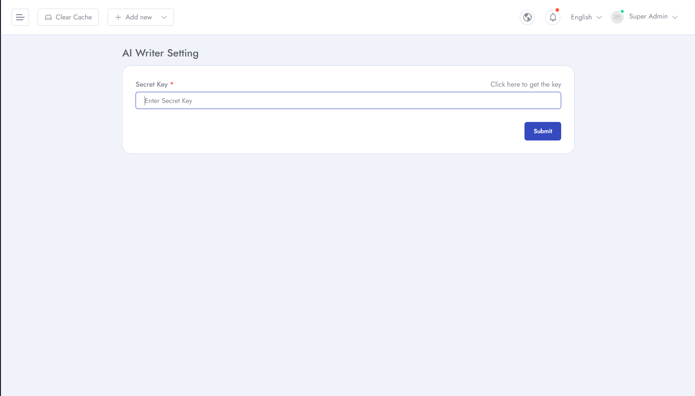
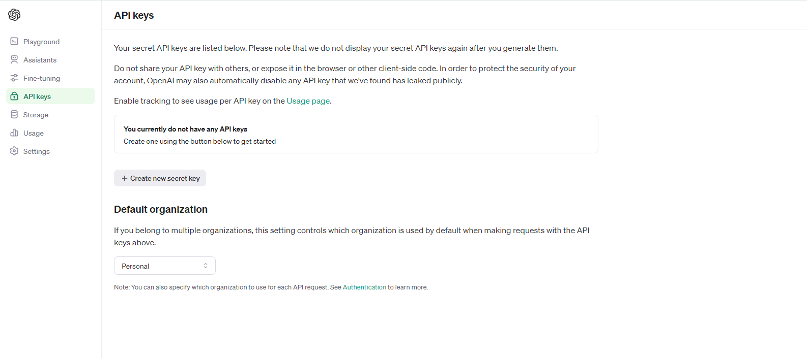

# AI Writer
To Manage **AI Assistant** related settings for your application follow the procedures…

- Go to **Admin Panel** &  click **AI Assistant** and can see two options *AI Writer* and *Settings*
- Here you can generate AI content by providing Use case and primary keyword.

- You have to create a API key in order to connect your application with **Open AI**. Click create key option from settings and then generate an API key.

