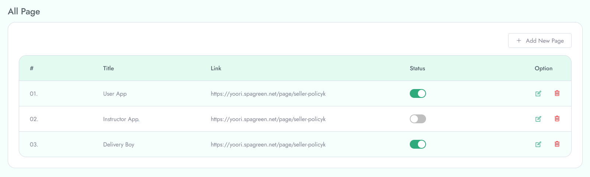

# Manage All Pages

To **Manage All Pages** follow the procedure...

Using **All Pages** option you can see the pages that you created adding with valuable information.

In **All Pages** there is a option **Create New Page**. From this section you can create a page by providing the information of **Title**, **Content**, **Meta Title**, **Meta Keyword**, **Meta Description**.

