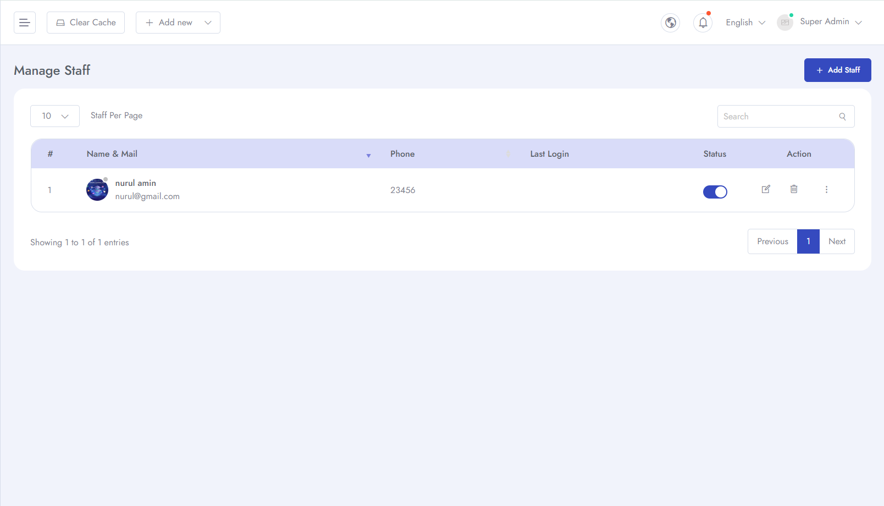
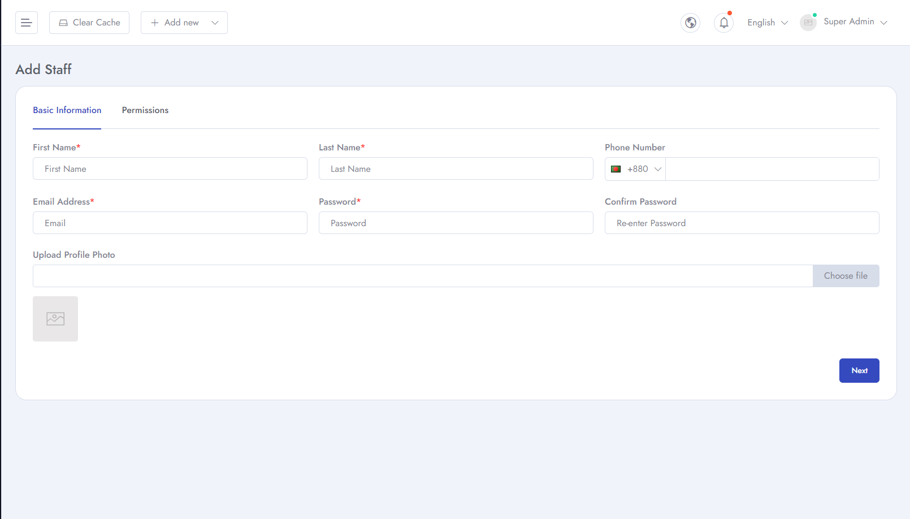
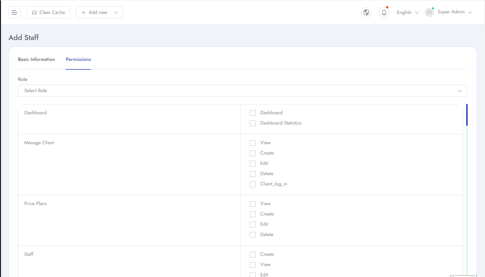
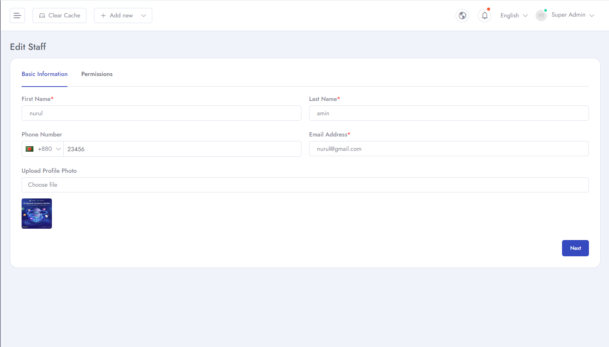
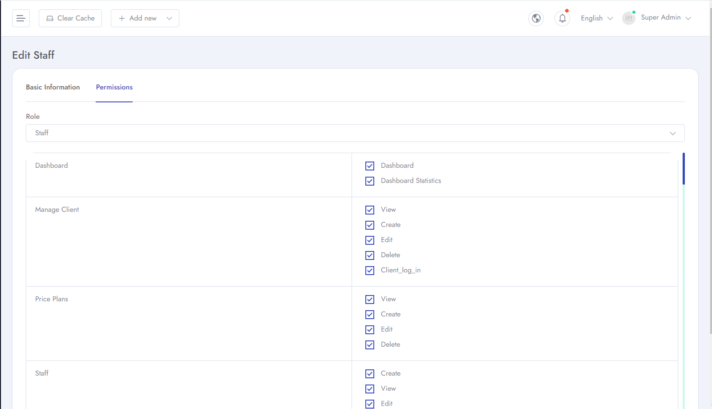
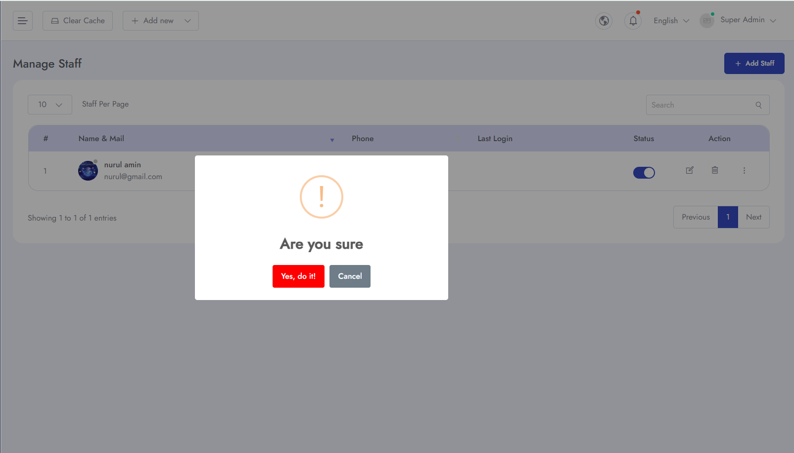

# All Staff
To Manage **Staff and Roles** for your application follow the procedures…

- Go to **Admin Panel** &  click **Staff** and can see two options *All Staff* and *Roles*

- then you can **Add Staff**. Here you can add new staff with **First Name, Last Name,Phone Number, Email Address, Password, Confirm Password, Profile Photo** .

- You can give specific permission of different access to the staff.

- You can **Edit** staff details and info.

- You can **Edit** staff permissions.

- You can **Delete** staff from the database.

