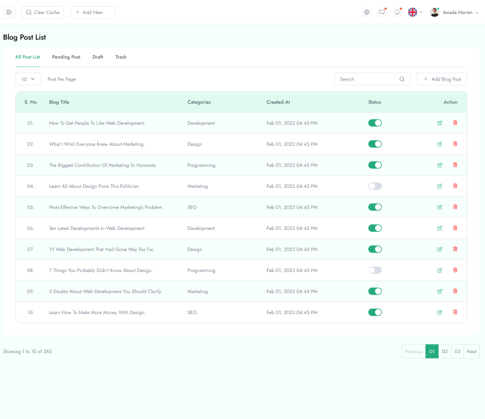

From **Admin Panel** you will get the **Blog** section and three options accessible in the Blog area.

**All Post**

From **All Post** option you can see all the blog that you posted before.

**Add New Post**

From **Add New Post** you can able to post new blog by providing the information of **Title**, **Category**, **Status**, **Short Description** and so on.

**Category**

In **Add New Post** you will find a field named **Category**. You can create any types of category by using the **Category** option.

