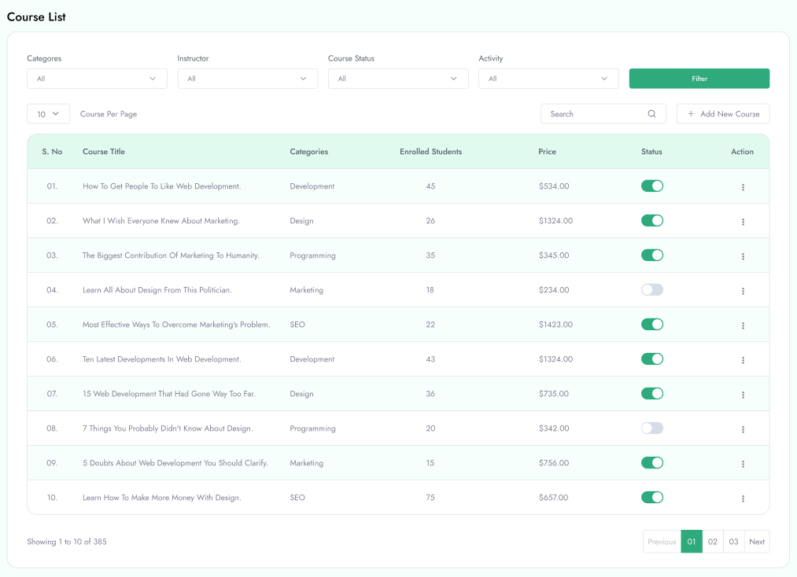
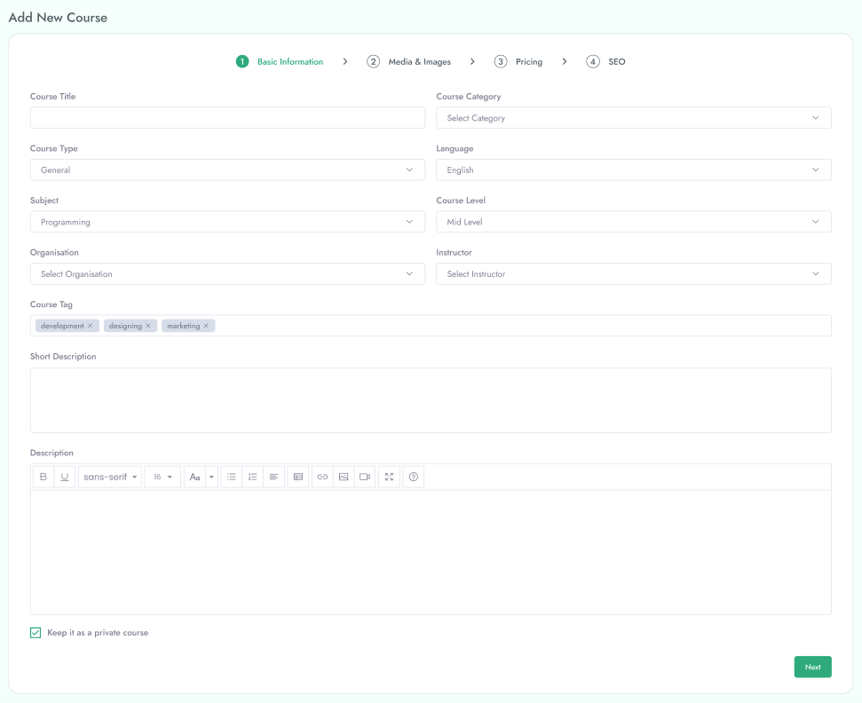
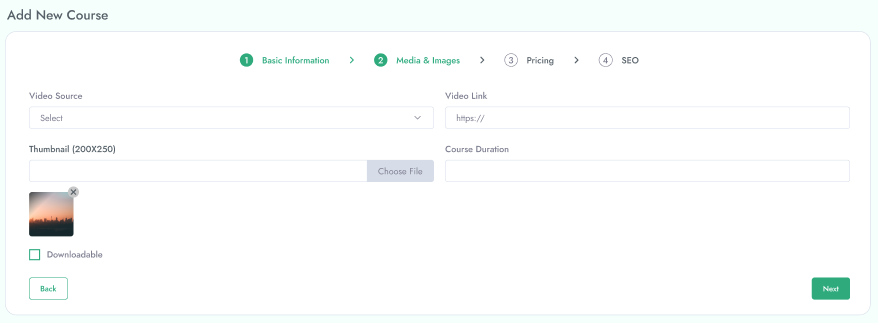
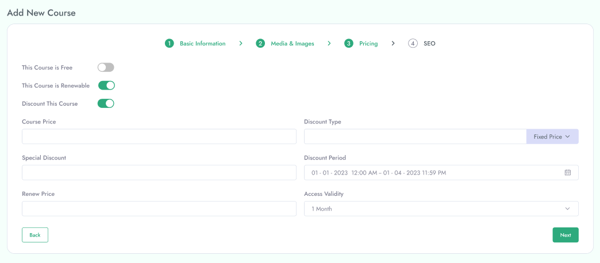
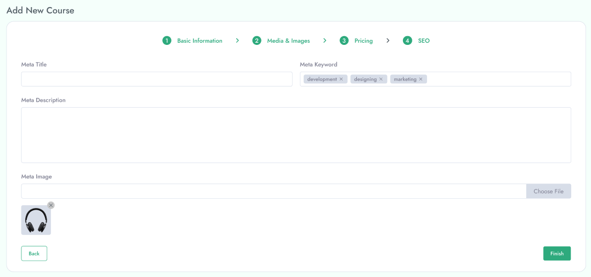

# Manage Course

 Manage Course from the **Course List** in the left menu of the admin area.

&nbsp;

**Search Course**

 You can search course by course name and instructor name.

**Filter Course**

 You can filter course by selecting category, organisation, instructor and course status .

**Update Status**

 You can update status of course by tapping status button.

**Delete Course**

You can delete any course by clicking Delete icon from right button. 
- When a course is deleted, all of their contents and related docs are automatically deleted permanently.

-Here you can view all course and also you can add new course with **Basic Information, Media & Images, Pricing, SEO** etc.

