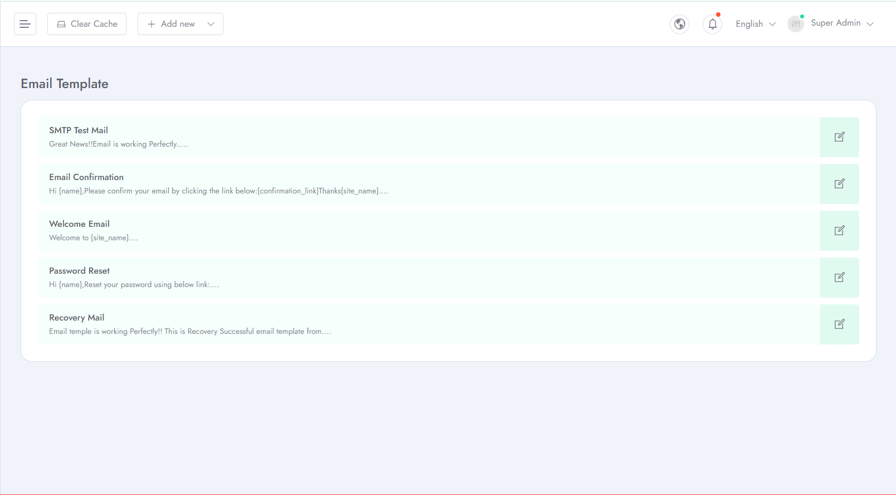
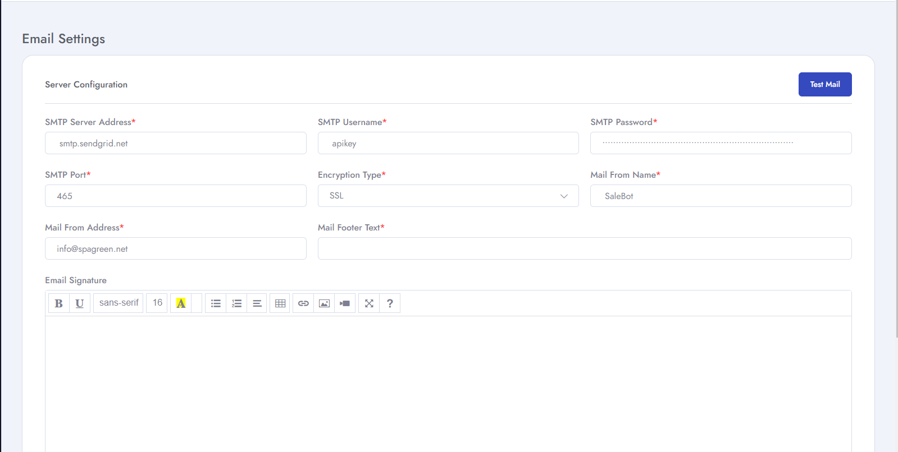

# Email Template and Server configuration
To Manage **Email** related settings for your application follow the procedures.

- Go to **Admin Panel** &  click **Email** for Email template and server configuration list.
- You can create your own customized template for emails.

- You have to configure your email for usage by configuring **SMTP Server Address, SMTP username, SMTP port, mail** related infos

