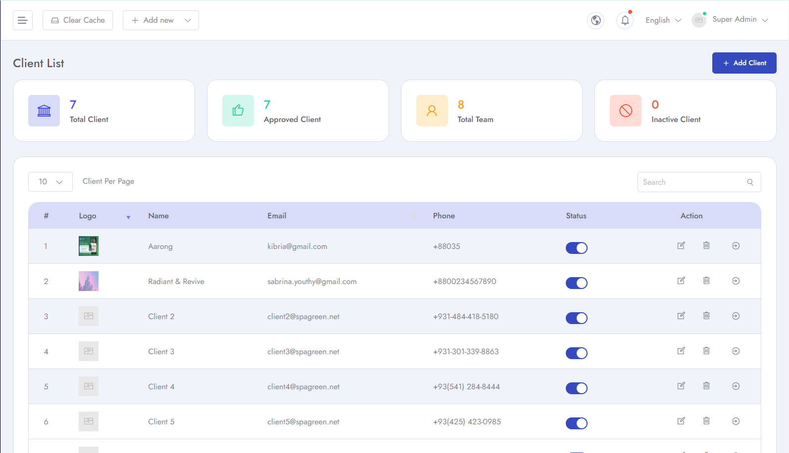
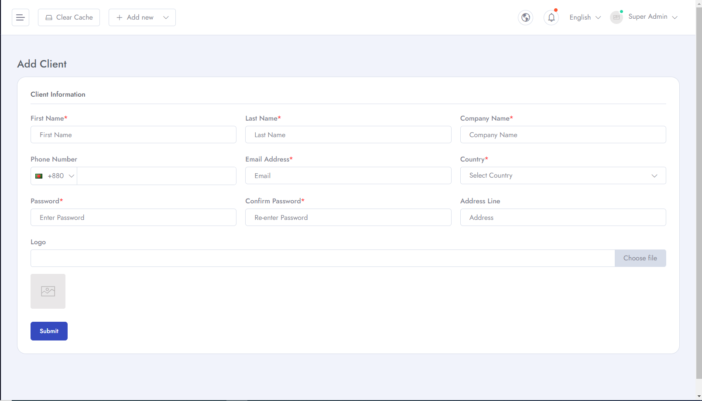
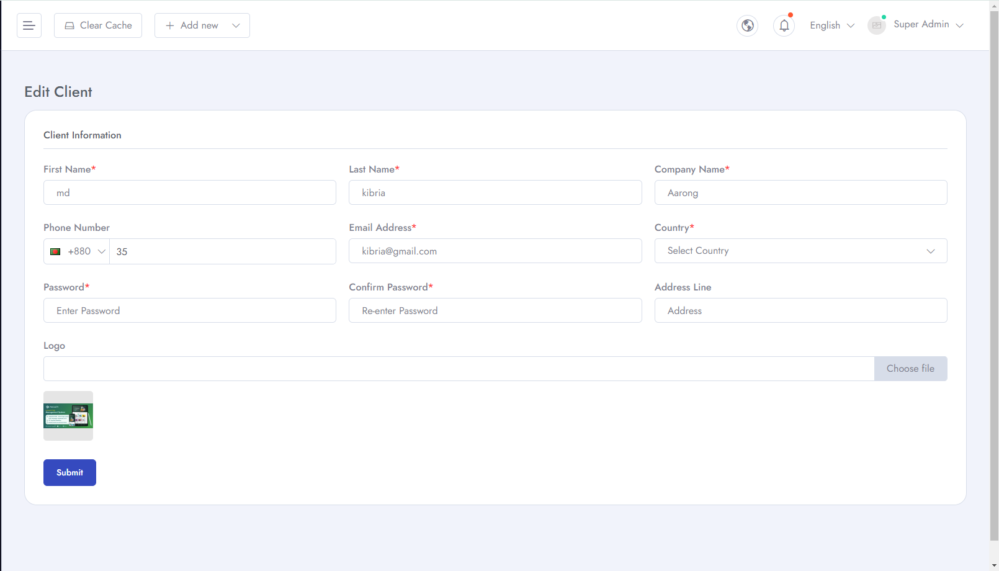
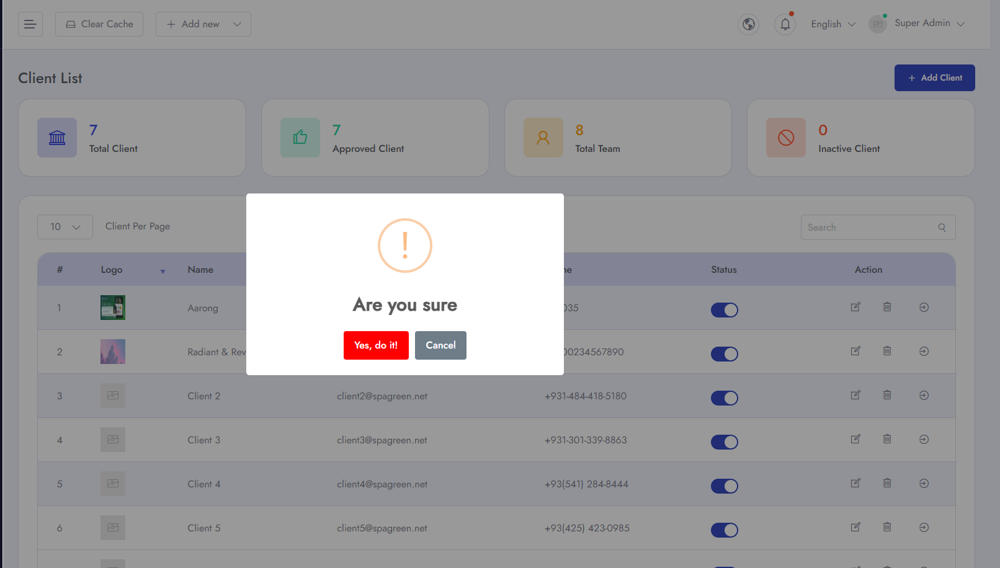
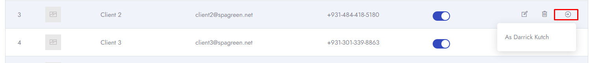

# Manage Client
To Manage **Clients** follow the procedures…

- Go to **Admin Panel** &  click **Manage Client** 

- then you can **Add Instructor**. Here you can add new instructor with **First Name, Last Name,Phone Number, Email Address, Password, Confirm Password, Company Name, Country, Address and Logo** etc.

- You can **edit** client details.

- You can also **Delete** client from the list.

- You can login as **Client** by clicking this butotn

