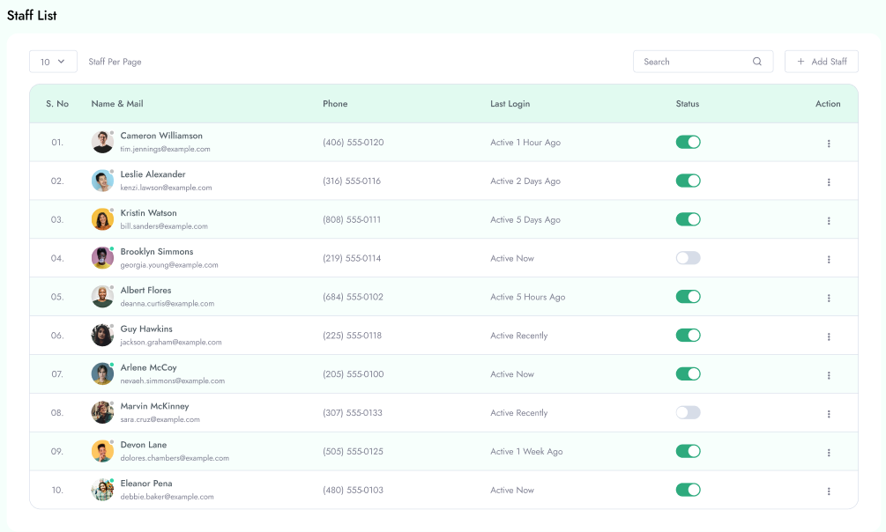
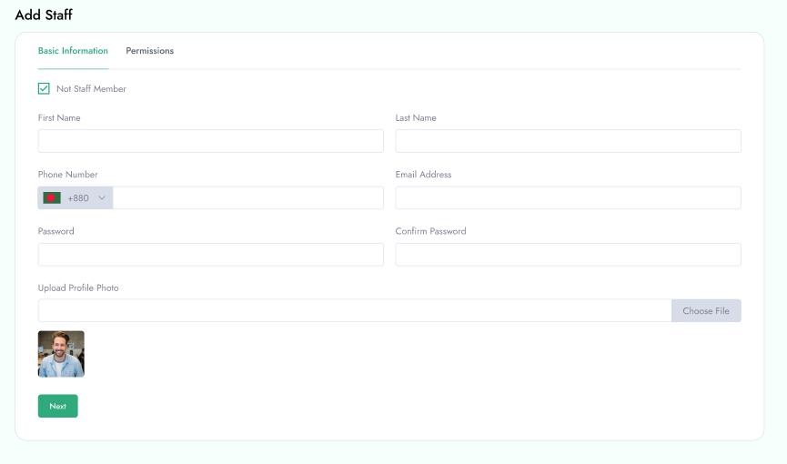

# Manage Staff
To Manage **Staff** follow the procedures…

 Manage Staff from the **Staff** in the left menu of the admin area.

&nbsp;

**Search Staff**

 You can search Staff by their name.

**Update Status**

 You can update status of staff by tapping status button.

**Delete Staff**

You can delete any staff by clicking Delete icon from right button. 
- When a staff is deleted, all of their credentials and activity are automatically deleted permanently. - If an Staff of deleted Staff come back to the website, a new Staff registration is required.

 Here you can view all Staff list and add new Staff with appropriate Information .

