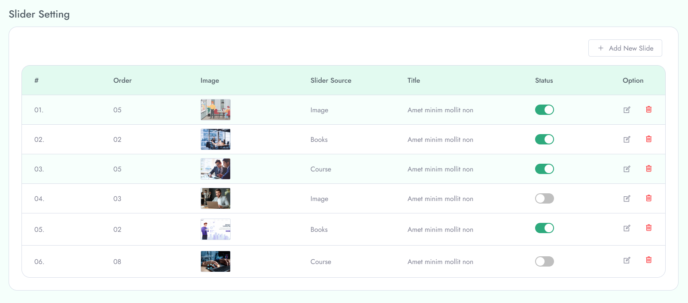
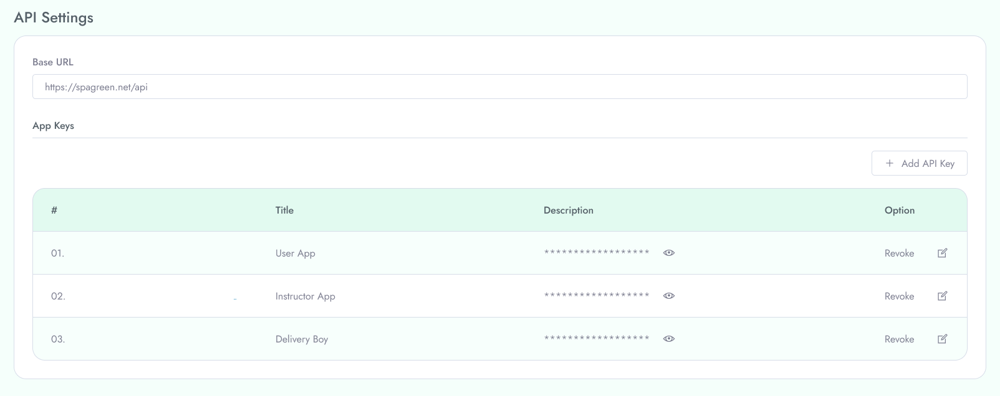
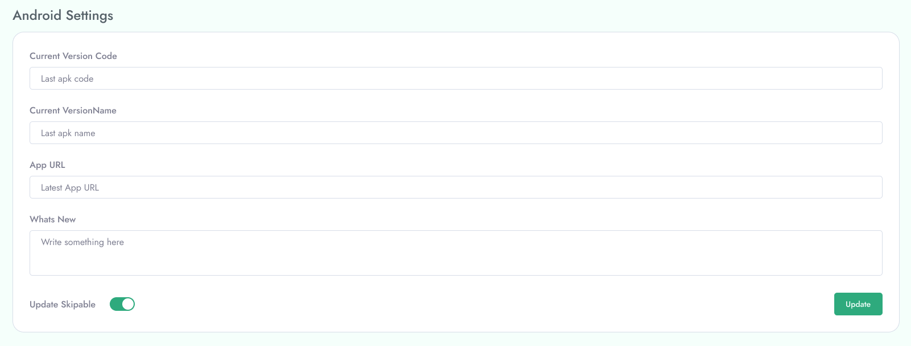
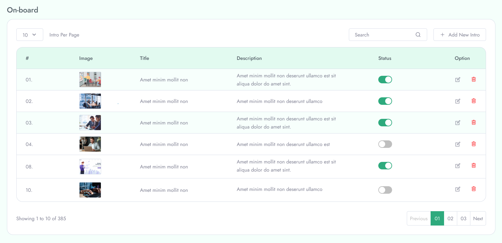

**On Board**

To Manage OnBoard follow the procedures…

Manage your mobile app on board screen data/images from OnBoard menu in the left menu of the admin area.

&nbsp;

**Slider**

 Set your mobile app slider images. Image status, edit slider, delete a slider from slider menu from left of the admin area.

 

**Api Setting**

 Find your API url for your mobile app in this section. You can copy API url, API keys from here. Add new api key, edit api key from here. 

 

**Android Setting**

Add your current mobile app version, Current version name, App Url, Whats new, set update is skiable or not. 

**iOS settings**

Add your iOS app current version code, current version name, App url, what’s new, and is update skiable or not. 

**GDPR**

Add your custom GDPR settings here. Add privacy, Terms and condition, about us, help and support

**Home screen settings**

Update your home screen settings from this menu section. Add top courses, instructors, Offer courses, Featured courses

