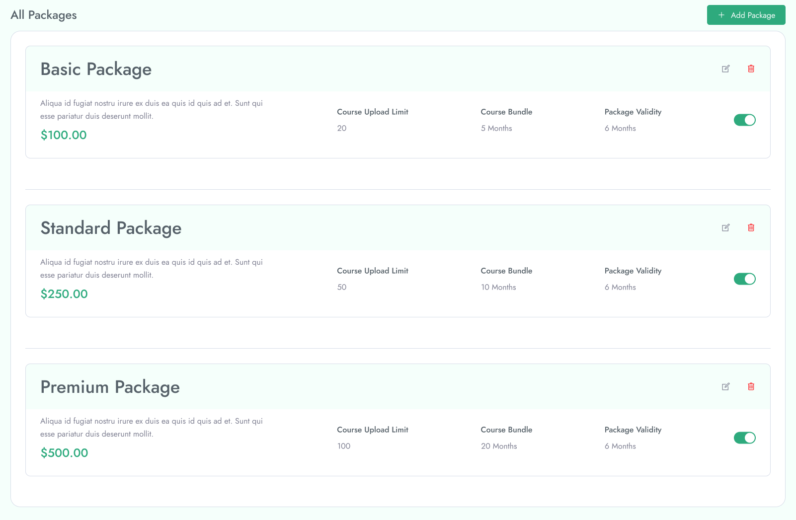
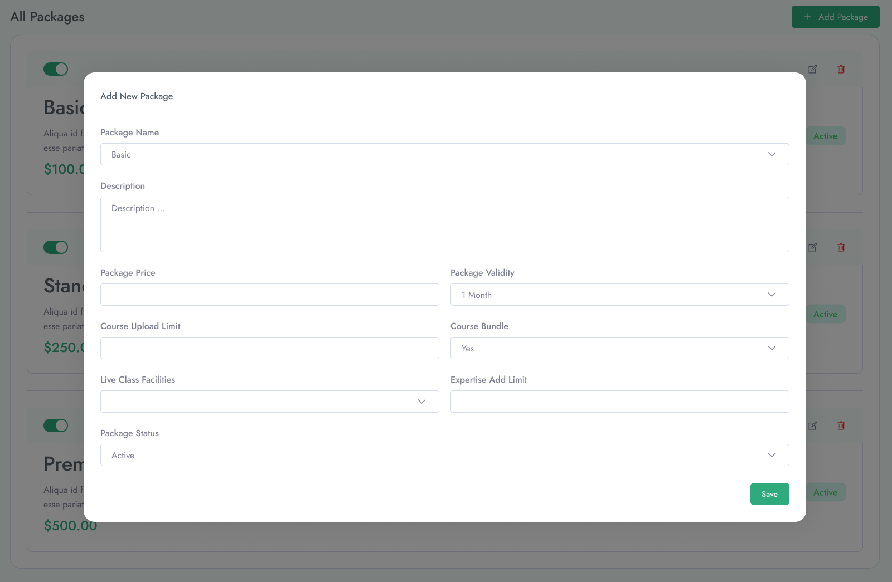

 **Packages**

From admin panel there is **Packages** option which is including for "Edit Packages", "Delete Packages" and user can able to see the available packge list from this option. 

&nbsp;

**Packages** option contain **Add Packages** option which is responsible to create custom packages by providing the **Package name**, **Description**, **Price** and so on.

