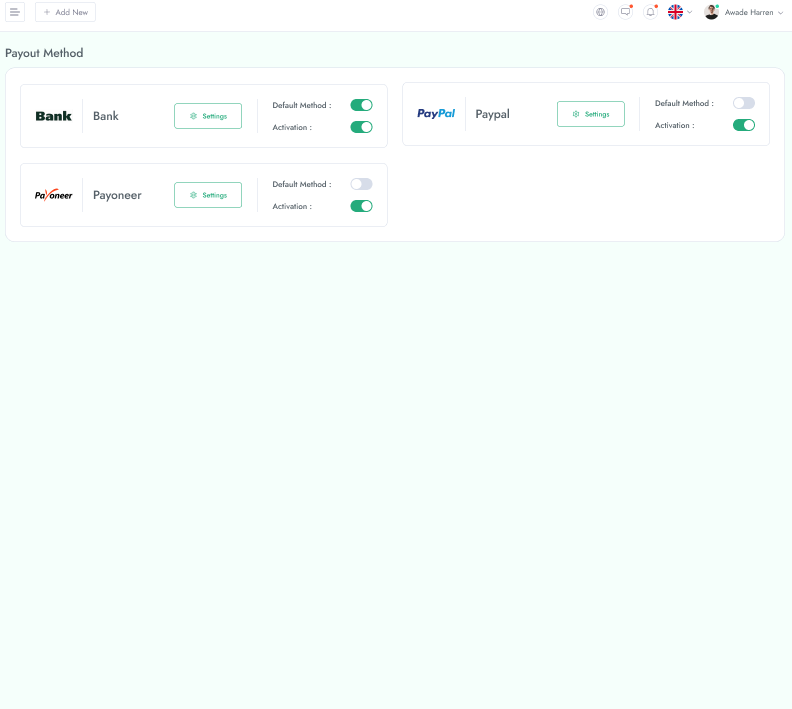
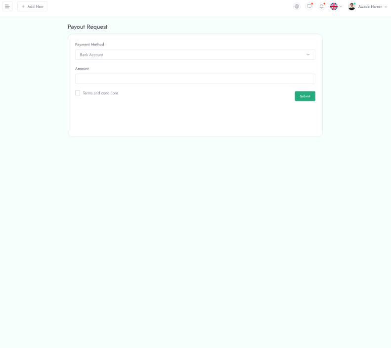
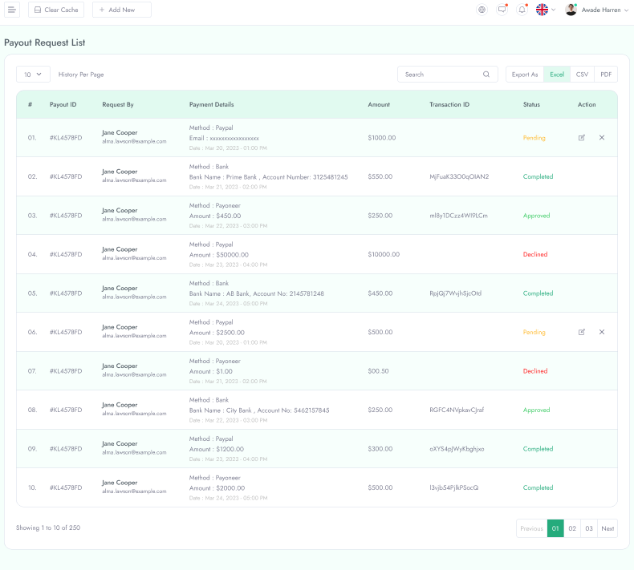

 **Payout**

From admin panel there is **Payout** option which contain three option.

**Payout Method**

In **Payout Method** option there are three payout method with a status activation button.using this button the payout status will be avtive/inactive.

&nbsp;

**payout Request**

In **payout Request** user need to provide the the information of **Organization**, **Payment Method**, **Amount** for requesting  a payment methaod.

&nbsp;

**Payout Request List**
 
 In **Payout Request List** all the privious payout request is shown.

 
