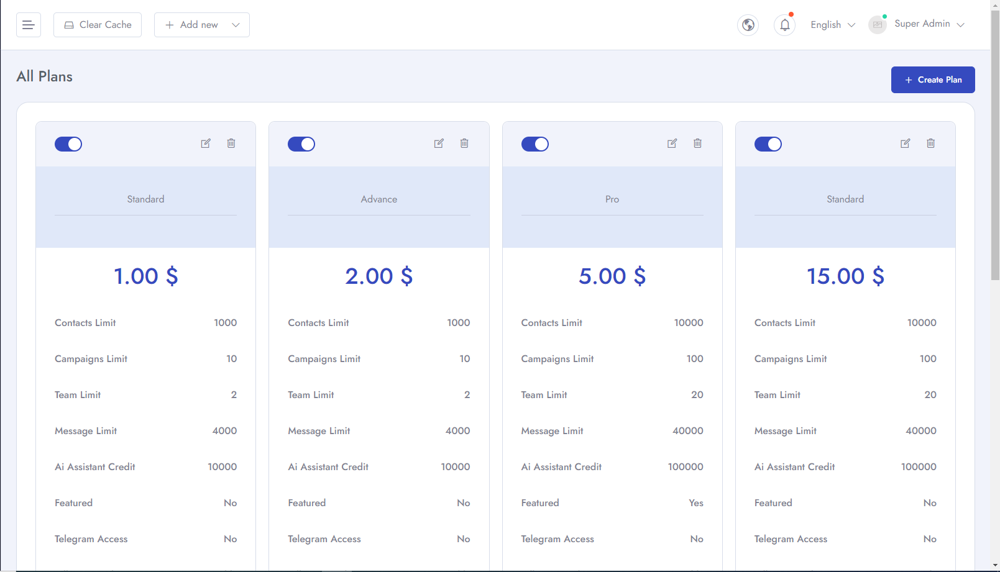
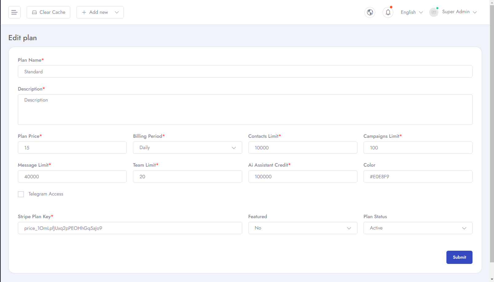
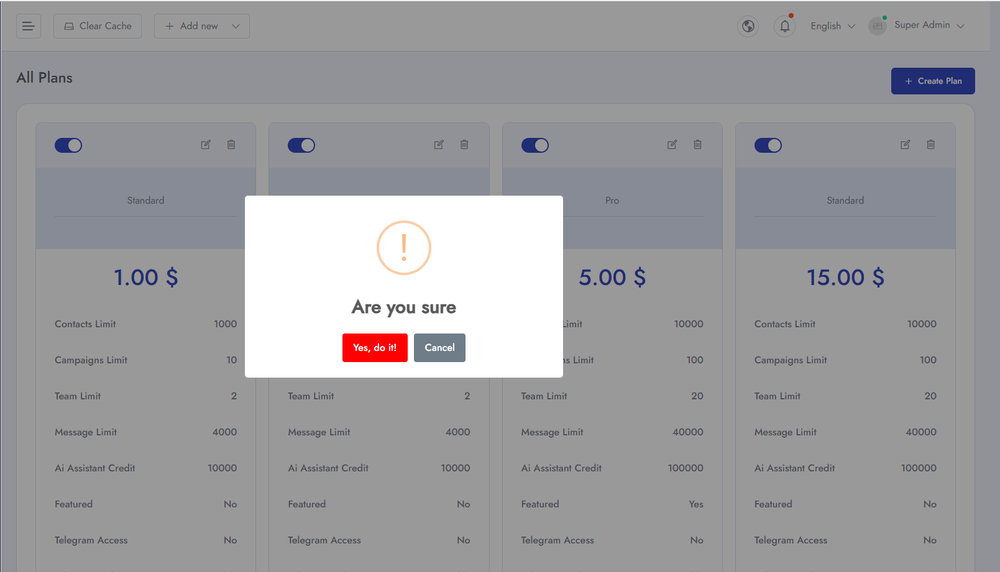

# Price Plan
To Manage **Price Plan** for your packages follow the procedures…

- Go to **Admin Panel** &  click **Price Plan** and can see all the added plans.

- then you can **Add Price Plan**. Here you can add new plan with **Plan Name, Description, Plan Price, Billing Period, Contacts Limit, Campaigns Limit, Message Limit, Team Limit, AI assistant credit, Color, Stripe Plan Key and Status** .

- You can **edit** plan details.

- You can also **Delete** plan from the list. And can also disable a speicific plan.

