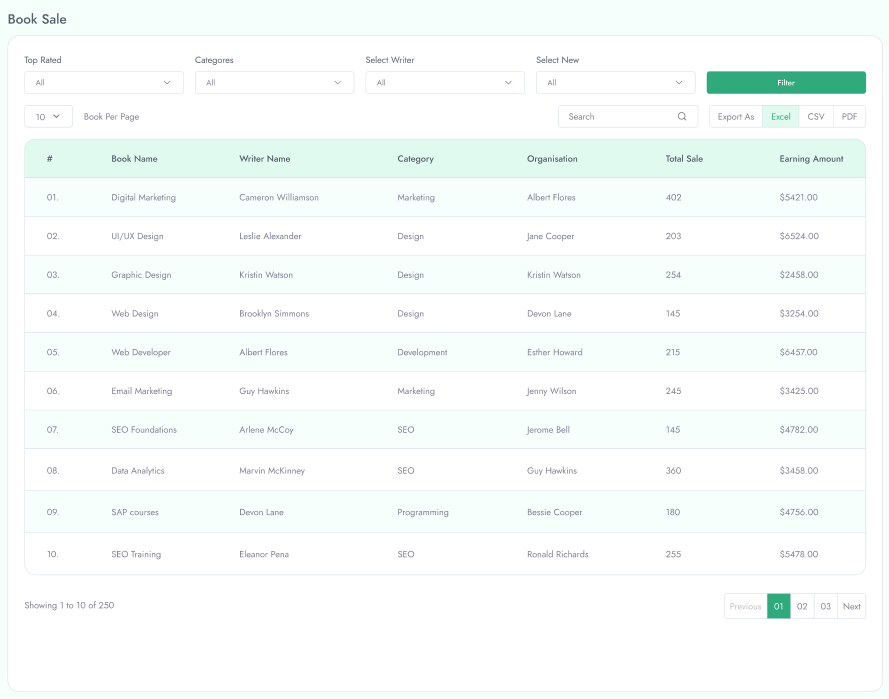

# Manage Report

To Manage **Report** follow the procedures…

 Manage Course Sale, Commission History, Payment History, Payout History, Book Sale and Wishlist from the **Reports** in the left menu of the admin area.

 

**Course Sale**

 Here You can find course sales list.

 

**Filter Course Sale**

You can filter course sales by selecting course, category, organization and date range .

**Commission History**

 You can find all commission history list also you can filter with date range.

**Payment History**
You can find all payment history and can filter with payment type and date range.

 

**Payout History**
You can find all payout history and can filter with payment type and date range.

 

**Book Sale**
You can find all book sales list and can filter book sales by select top rated, categories, select writer and select new .

**Wishlist**

All wishlist book list will apear here. You can filter wishlist by selecting category and organization .
