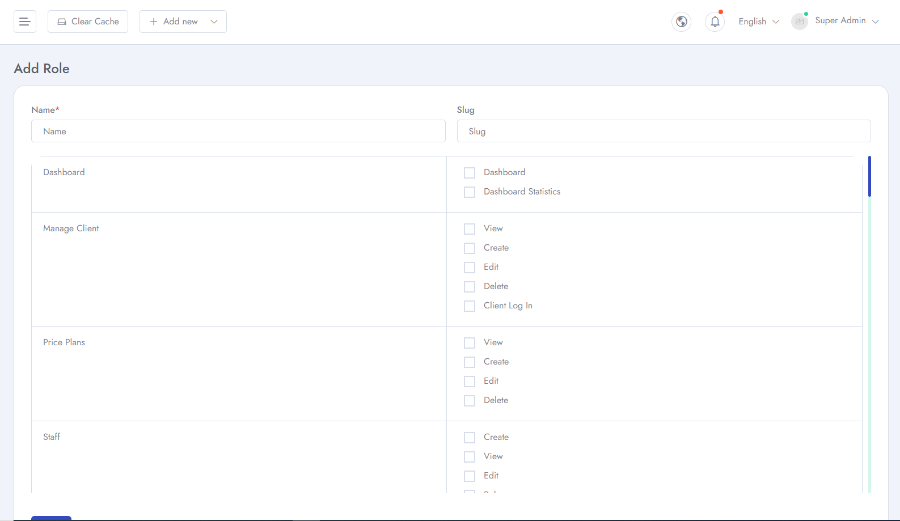

# Roles
To Manage **Roles** related settings for your application follow the procedures…

- Go to **Admin Panel** &  click **Staff** and can see two options *All Staff* and *Roles*
- Here you can add new roles for the website.

- You can also turn on or turn off specific roles.

