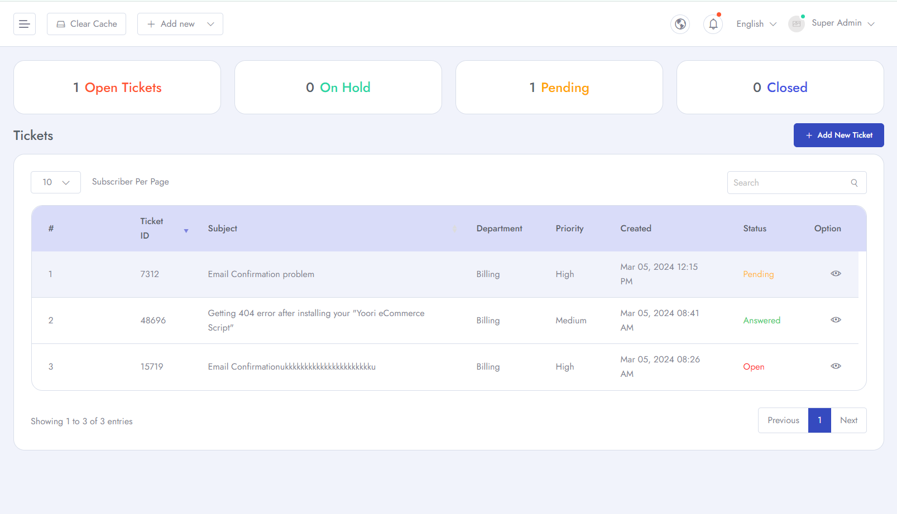
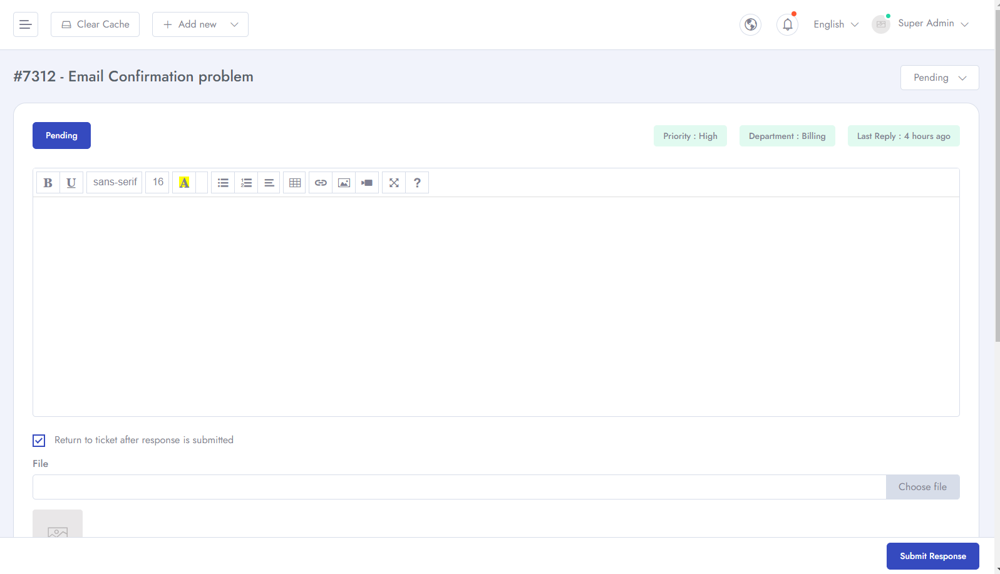
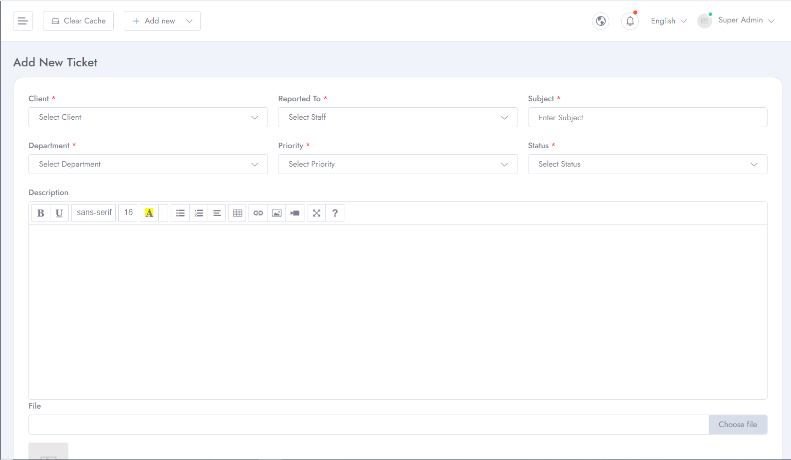
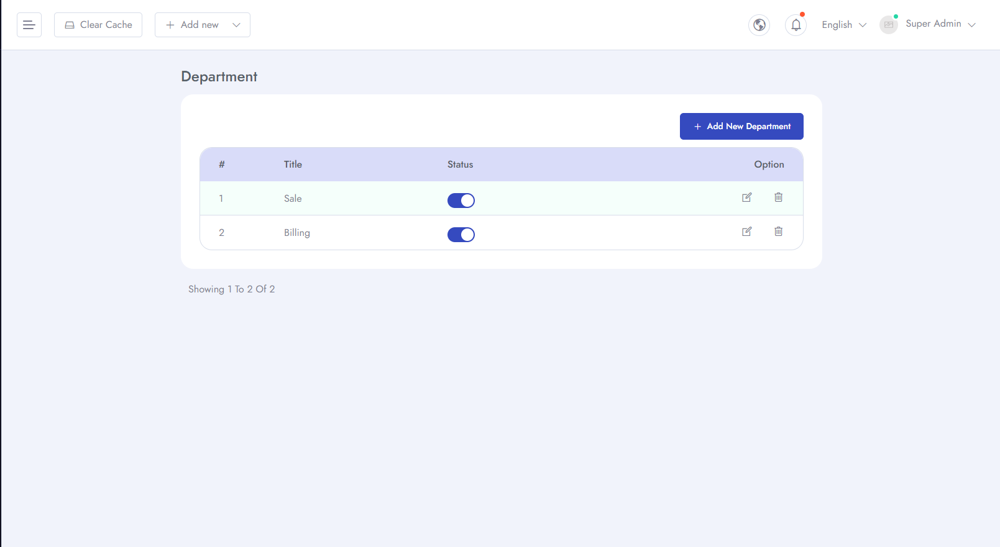
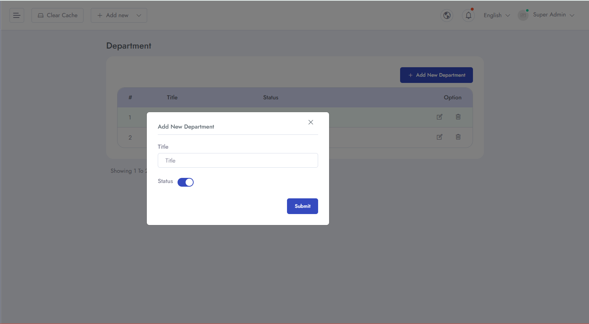
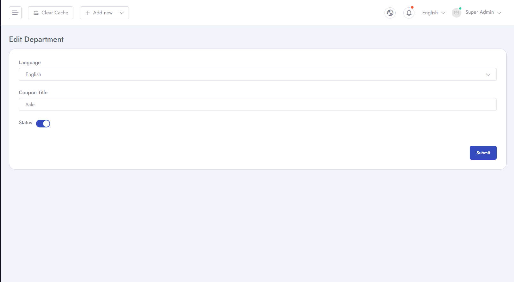
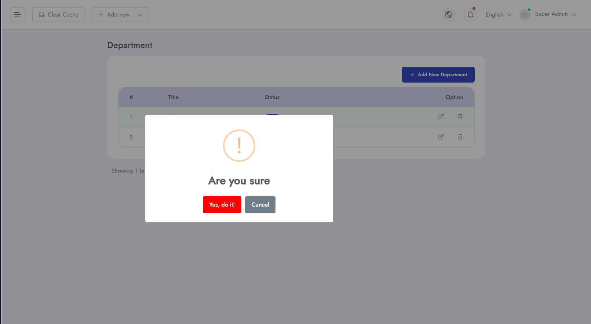

# Support
To Manage **Support** related settings for your application follow the procedures.

- Go to **Admin Panel** &  click **Support** for related settings.
- You can see all the tickets and their status.

- You can see the details of the ticket.

- You can add new ticket.

- You can add new department for different ticket options.

- You can edit the details of the department.

- You can edit the details of the department.

- You can delete any department.

