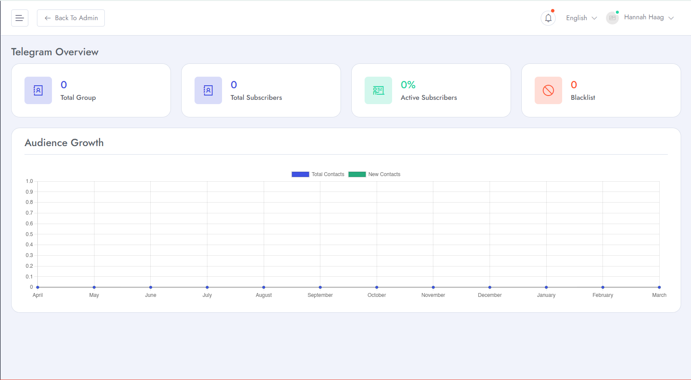
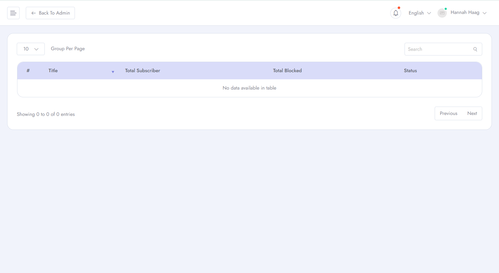
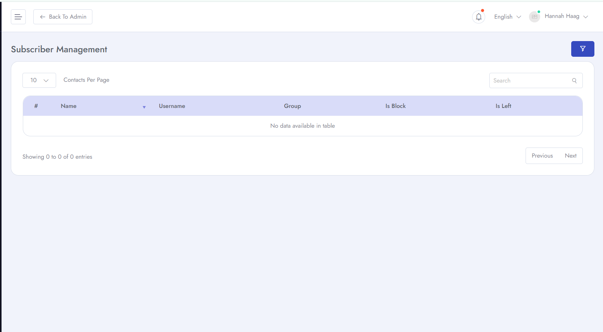
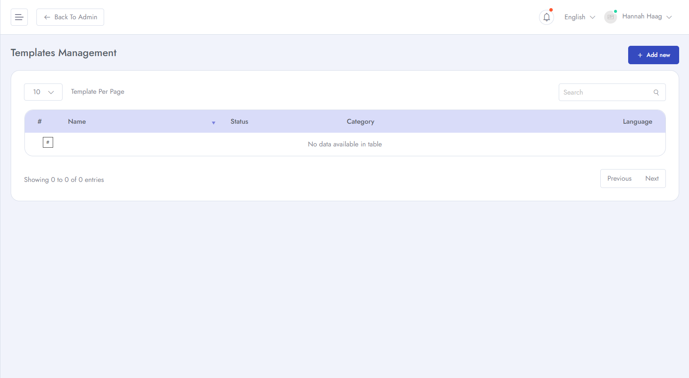
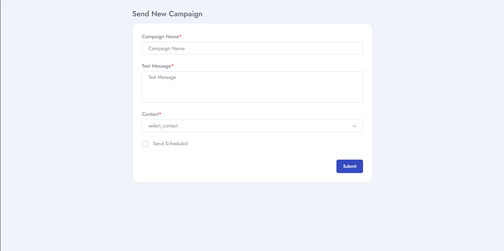

# Telegram Features
To Manage **Telegram** related features for your application follow the procedures.

- Login as **Client** &  click **Telegram** and you will find different options for telegram.
- You can see your details telegram stats.

- You can see your subscriber list from here.

- You can manage your subscriber.

- You can create your own telegram template.

- You can create and send new campaign from here.

