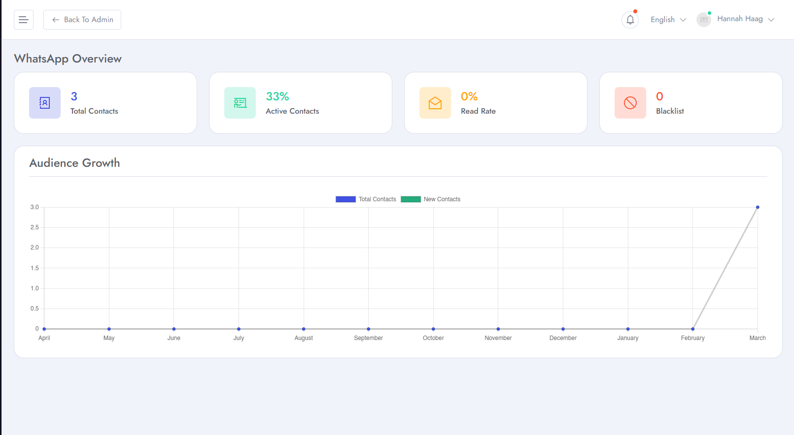
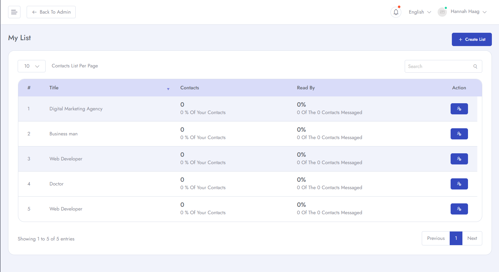
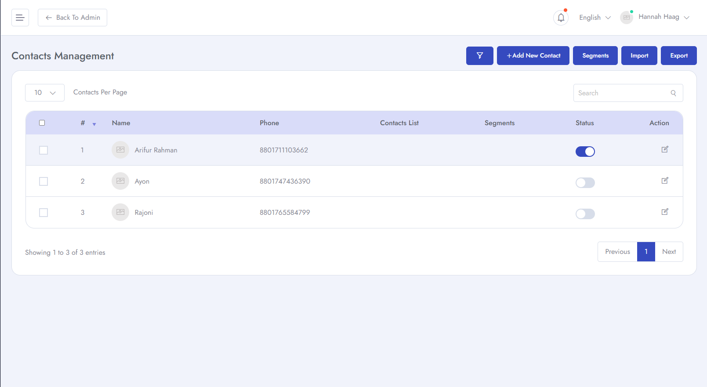
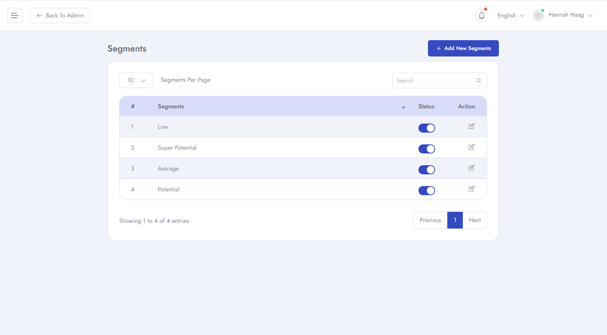
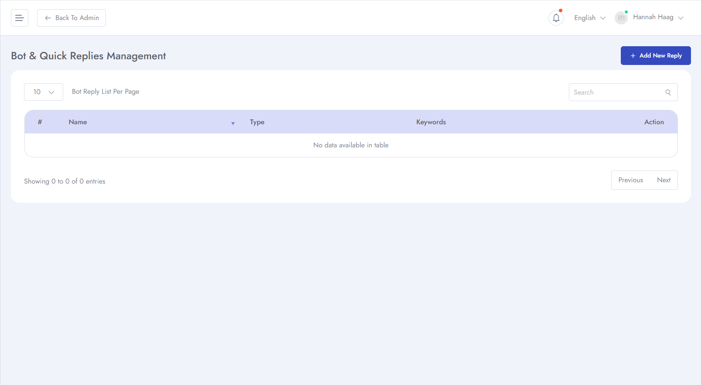
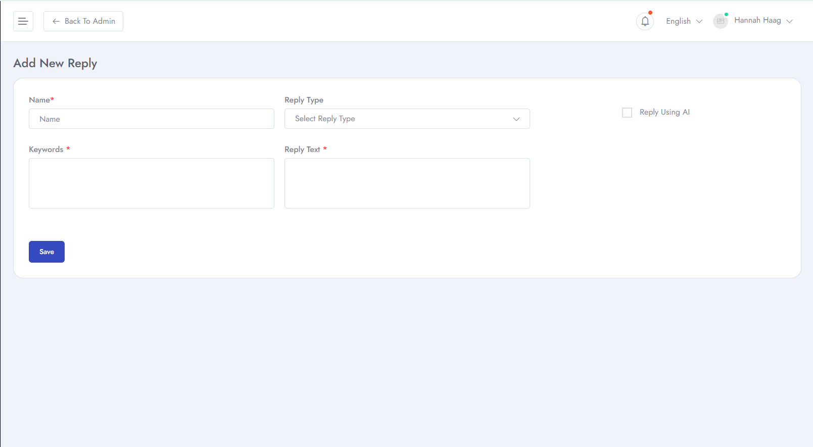
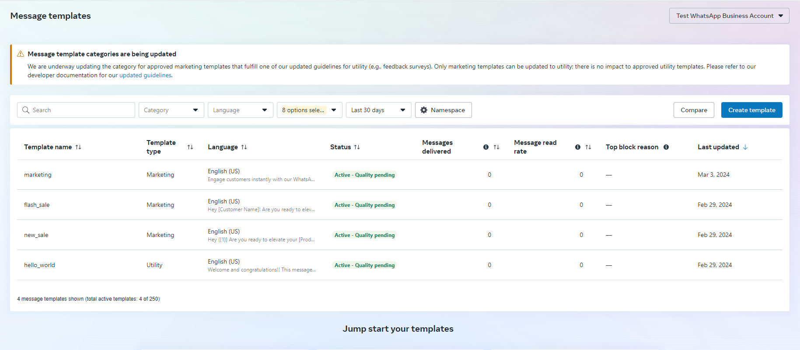
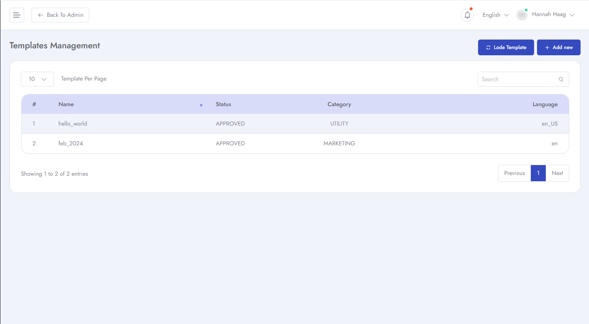

# Whatsapp Features
To Manage **Whatsapp** related features for your application follow the procedures.

- Login as **Client** &  click **Whatsapp** and you will find different options for telegram.
- You can see details overview of Whatsapp features.

- You can see details list of your **Whatsapp** contacts list.

- You can manage contacts of your whatsapp added contact list.

- You can add segments for potential clients.

- You can create Bot and Quick replies which can be used for sending bulk messages to the saved contacts.

- You can add new reply for client's messages.

- Templates can be added from your **[developer.facebook.com](https://business.facebook.com/wa/manage/message-templates/)** account and can load templates here. 

