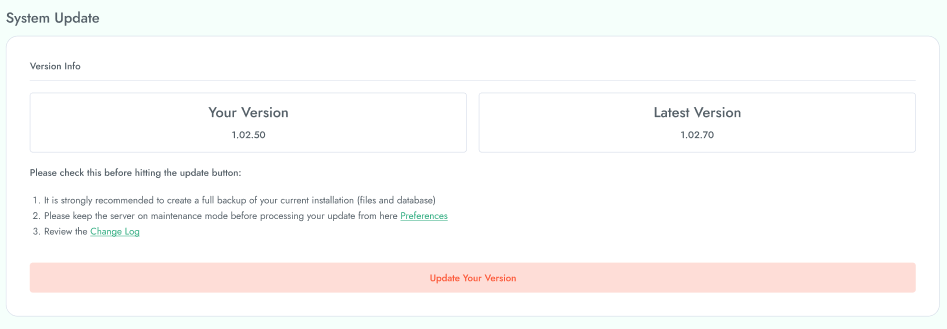
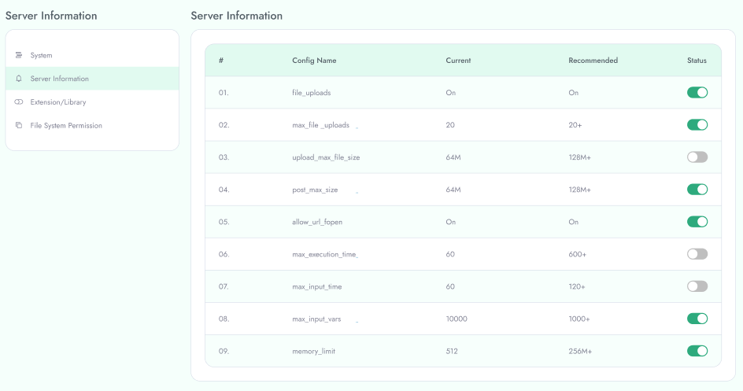

---
title:   Manage System Update
sidebar_label:    Manage System Update
---

# System Update

To Manage **System Update** follow the procedures…

 Select **Utility** in the left menu of the admin area.

&nbsp;

**System Update**

 Here you can update your system with latest version .

# Server Information

 Here you can find various type of server information like system information, server information, extension 
Library and file system permission . 

**Update Server Information**

You can update status by tapping switch button.
